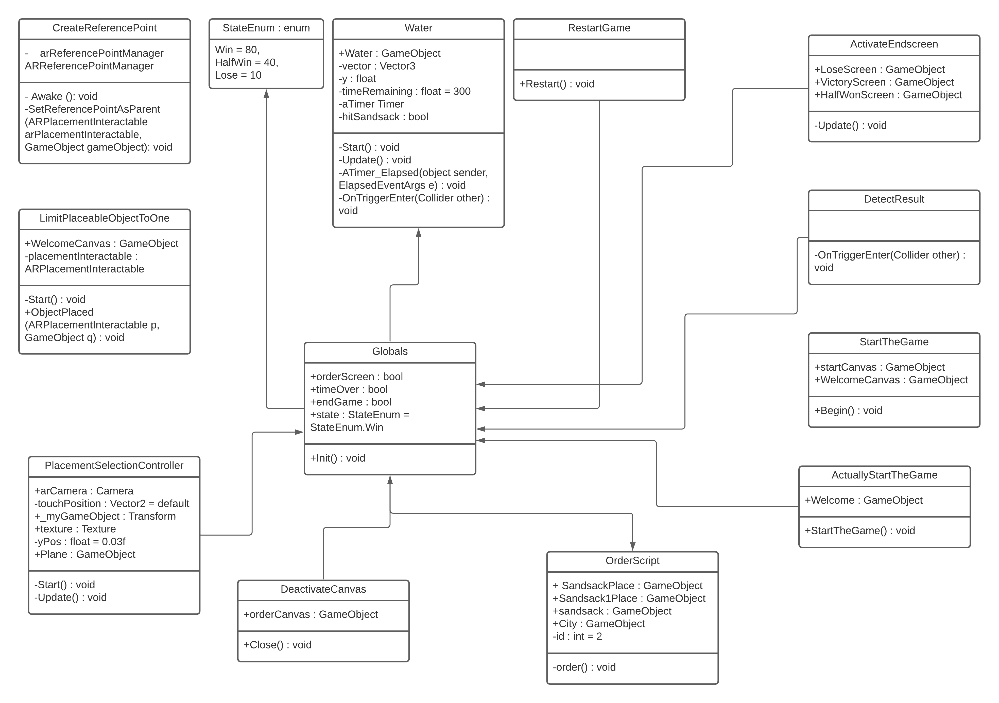
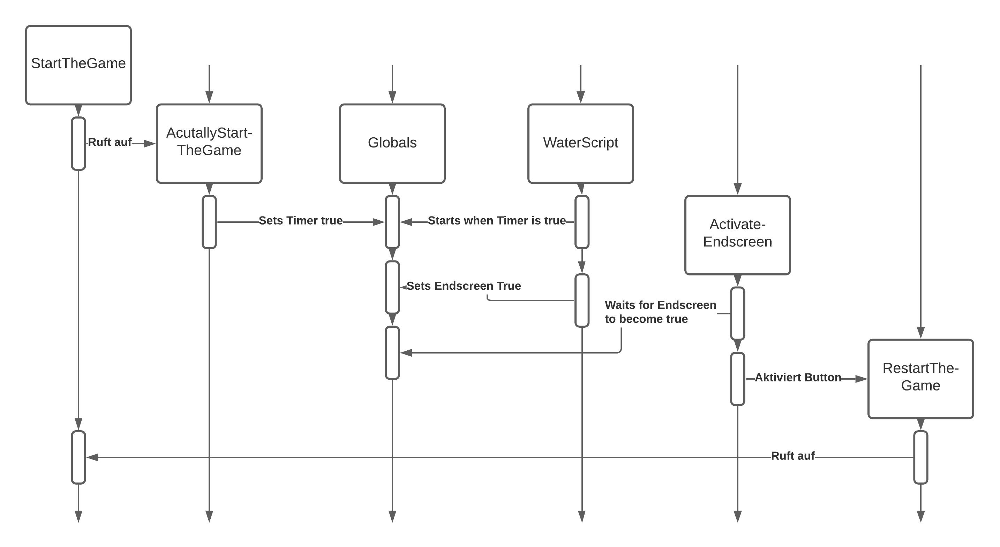

# Technische Dokumentation
von Kenzo Rohde und Kelvin Leclaire

## Logik
Das Spiel startet in der MainScene mit dem StartCanvas. Dieser wird beim Drücken des Startknopfes deaktivert und aktiviert den Welcome Canvas.
Man kann nun bereits das Kamerabild sehen und bekommt durch einen Text und eine Audiodatei das Setting des Spiels erklärt.
Wenn man nun auf Start drückt kann man seine Stadt platzieren und der Timer startet.
In dem [WaterScript](../Water/WaterScript.cs) fängt das Wasser mit jedem Timertick an in y-Richtung zu skalieren. Sobald ein Wasser-Cube auf einen Sandsack
trifft stopt dies.
Die Sandsäcke lassen sich durch den [PlacementSelectionController](../Raycast/PlacementSelectionController.cs) platzieren. Hier wird der Raycast dafür verwendet,
dass der erste Touch, sollte er einen Sandsack treffen, diesen auswählt und der zweite Touch, falls ein Sandsack ausgewählt ist, diesen platziert.
Hierbei kann der Spieler nicht jeden Sandsack beliebig platzieren, sondern nur in den dafür vorgesehnen Dropzones.
Dieses Script ermöglicht es auch, dass durch ein Tippen auf die Telefonzelle der OrderCanvas aufgerufen wird. 
Hier kommt das [OrderScript](../OrderCanvas/OrderScript.cs) ins Spiel. Per Knopfdruck werden zwei neue Sandsäcke bestellt und in der Ladezone platziert.
Der Spieler ist auf 8 Sandsäcke pro Runde limitiert.
Wenn der Timer aus dem WaterScript abgelaufen ist, wird einer der drei EndCanvases sichtbar. Über 3 Checkpoints, welche in dem [DetectResult Script](../EndScreen/DetectResult.cs) überprüfen, bis wo das Wasser
vordringen konnte, wird entweder der Victory Screen, der Haltwin Screen, oder der Lose Screen aufgerufen. Hier wird erneut eine Audiodatei abgespielt
und der Spieler ist in der Lage das Spiel neuzustarten. Dafür resettet das [RestartGame Script](../EndScreen/RestartGame.cs) alle globalen Variablen und läd die Mainscene neu.

#### UML Diagramm

#### Ordnerstruktur
- Assets
     * Audio
     * Canvas
          - Materials
     * Imports
         - BrokenVector
         - FlamingSands
         - HousePack
         - LowpolyStreetPack
         - phone
         - POLYGON city pack
         - Stylize Water Texture
         - swing
     * Material
     * Prefabs
         - Materials
     * Scenes
     * Scripts
         - AR Placeable
         - EndScreen
         - Globals
         - Markdown
         - OrderCanvas
         - Raycast
         - StartScreen
         - Water
     * XR
     * City

## Eigenleistung
Selbst erstellt haben wir das Design für die Dropzones, auf denen man als Spieler die Sandsäcke platzieren kann. Außerdem die Ladezone in der zu Beginn des Spiels die Sandsäcke stehen und die neu angeforderten gespawnt werden. 
Des Weiteren sind der Start Screen, die verschiedenen Endscreens und das Design für die UI Buttons “Start” und “Neustart” selbst gemacht. 
Wir haben den Eingangsdialog des Bürgermeisters und die Enddialoge, die je nach Spielende eingespielt werden, selbst aufgenommen. 
Die Skripte sind fast alle selber geschrieben, wobei wir uns an der Unity Dokumentation orientiert haben und für einzelne Fälle inspiration bei www.stackoverflow.com geholt haben.
## Quellen für Code
Für das Selektieren einzelner Objekte via Raycast haben wir uns an folgendem Video orientiert: 
https://www.youtube.com/watch?v=Vn9TrFJo1tw
https://answers.unity.com/questions/537673/raycast-object-tag-check.html

## Assets aus dem Unity Store
https://assetstore.unity.com/account/assets

- Gras:
https://assetstore.unity.com/packages/2d/textures-materials/glass/stylized-grass-texture-153153

- Schaukel:
https://assetstore.unity.com/packages/3d/props/exterior/swing-19032

- Zaun:
https://assetstore.unity.com/packages/3d/props/exterior/low-poly-fence-pack-61661

- Telefonzelle und Baum
https://assetstore.unity.com/packages/3d/environments/urban/city-package-107224

- Wasser Textur:
https://assetstore.unity.com/packages/2d/textures-materials/water/stylize-water-texture-153577

- Häuser:
https://assetstore.unity.com/packages/3d/environments/house-pack-35346

- Sandsäcke
https://assetstore.unity.com/packages/3d/props/exterior/realistic-sandbags-95964

## Testing
Die AR-App wurde auf vier verschiedenen Android Geräten (Honor 8X, One Plus 8, Huawei P30 Pro und Samsung S10) getestet. Außerdem wurde sie in besser und schlechter beleuchteten Umgebungen getestet. Hierbei fiel auf, dass eine grundsätzlich gute Beleuchtung wichtig ist. Andernfalls könnte das finden einer Plane länger dauern und die Reference Points sind nicht so zuverlässig. 

## Programm-Ablauf-Diagramm 
